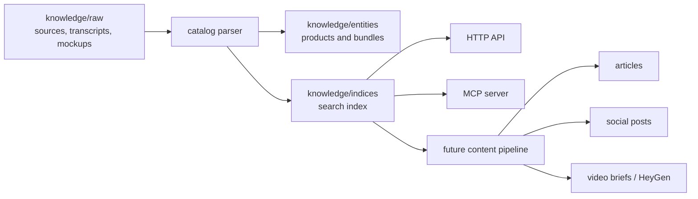

# Architecture

## Runtime

The project exposes the same knowledge through two access layers:

- HTTP API for services, admin panels, webhooks, and simple integrations.
- MCP server for AI agents and tools that need structured context.

Both layers load the knowledge base from local files, so the project can run without a database during the first phase.

## Future upgrade path

When the corpus grows, this structure can move to a database or vector index without changing the public contract:

- Keep entity IDs and slugs stable.
- Keep MCP tool names stable.
- Add embeddings and provenance fields beside the current text index.
- Add review states for generated content.
