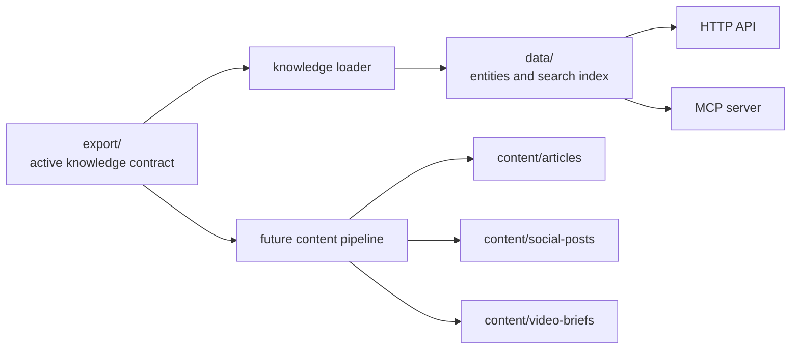

# Architecture

## Runtime

The project exposes the same knowledge through two access layers:

- HTTP API for services, admin panels, webhooks, and simple integrations.
- MCP server for AI agents and tools that need structured context.

Both layers read from `export/` and generated `data/` files. There is no separate hidden source layer.

## Gateway Pattern

The layout follows the same idea as `MH_Knowledge_Gateway`:

- `export/knowledge/*.md` is the human-readable knowledge contract.
- `export/runtime/*.md` explains how services should use the contract.
- `data/*` is a derived machine layer.
- historical or diagnostic material should go to `artifacts/` only when needed.
