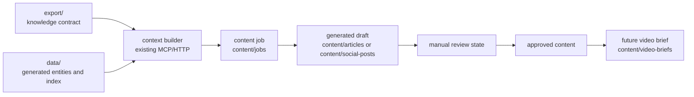

# Armanda Plan: Moldir Base Content Pipeline Foundation

Date: 2026-06-11
Spec: `docs/specs/2026-06-11-armanda-content-pipeline.md`
Status: Gate 4 complete

## Objective

Implement the Phase 2 foundation for auditable article and social content generation while keeping Moldir Base as an `export/`-first knowledge gateway.

This iteration should not call LLMs, HeyGen, or publishing APIs. It should define stable storage, metadata, templates, validation, and documentation so generation can be added safely in later passes.

## Gate 3 Approval

The user approved this plan on 2026-06-11.

## Architecture

## Data Flow

1. A human or future service creates a content job with topic, audience, format, platform, source product slugs, and source document IDs.
2. The job references knowledge from `export/knowledge` and structured entities from `data/entities`.
3. A generated draft is stored under `content/articles` or `content/social-posts`.
4. Every output carries metadata: source IDs, product slugs, prompt version, generator, date, review status, reviewer, and compliance notes.
5. Approved social scripts or article sections can later feed `content/video-briefs` and HeyGen payload generation.

## Files To Create Or Change

- `content/README.md`
  - Explain content directory conventions and review states.
- `content/jobs/.gitkeep`
  - Reserve job request storage.
- `content/articles/.gitkeep`
  - Reserve article output storage.
- `content/social-posts/.gitkeep`
  - Reserve social output storage.
- `content/video-briefs/.gitkeep`
  - Reserve later video brief storage.
- `export/templates/content-job.md`
  - Human-readable request template for article/social generation jobs.
- `export/templates/generated-article.md`
  - Output template with required metadata.
- `export/templates/generated-social-post.md`
  - Output template with required metadata.
- `export/runtime/CONTENT_PIPELINE.md`
  - Expand from future note into practical Phase 2 contract.
- `docs/content-rules.md`
  - Ensure compliance and review rules match the new metadata model.
- `docs/roadmap.md`
  - Mark Phase 2 foundation scope separately from later automation.
- `README.md`
  - Add a short pointer to the content pipeline foundation.

## Optional Code Changes

No TypeScript changes are required for the MVP unless implementation discovers that validation or indexing expects missing content directories.

If code is changed, it must be limited to preserving or exposing the same content metadata contract and must keep existing HTTP/MCP behavior stable.

## API, MCP, And Schema Changes

MVP:

- No breaking HTTP API changes.
- No breaking MCP changes.
- No new persisted database schema.

Later:

- Add MCP tools for `create_content_job`, `list_content_jobs`, and `get_content_job`.
- Add HTTP endpoints for content job management.
- Add generated content indices if content search becomes required.

## MVP Now

- Document the `content/` storage contract.
- Add request/output templates for article and social content.
- Define required metadata and review states.
- Keep generated content outside `export/knowledge`.
- Update runtime docs so future services know how to consume source knowledge.
- Verify existing indexing and gateway behavior still works.

## Later Phases

- Add actual LLM prompt orchestration.
- Add batch generation.
- Add platform-specific exporters for Instagram, Telegram, YouTube Shorts, TikTok, and website articles.
- Add HeyGen-ready payload generation.
- Add admin UI or review dashboard.
- Add publishing integrations.

## Validation

- Run `npm run validate`.
- Start HTTP server with `npm run dev` for smoke checks if not already running.
- Check `GET /health`.
- Check at least one knowledge endpoint, for example `GET /api/catalog` or `GET /api/search?q=ashitaba`.
- If MCP files or tools change, run MCP `tools/list` or a targeted `tools/call`.
- Confirm there are no references to a recreated `knowledge/raw` layout.

## Implementation Checklist

- [x] Create content directory contract in `content/README.md`.
- [x] Add `.gitkeep` files for empty content output directories.
- [x] Add `content-job` request template.
- [x] Add generated article template.
- [x] Add generated social post template.
- [x] Expand `export/runtime/CONTENT_PIPELINE.md`.
- [x] Update `docs/content-rules.md`.
- [x] Update `docs/roadmap.md`.
- [x] Update `README.md`.
- [x] Run validation and HTTP smoke checks.
- [x] Review changes against spec and plan.

## Gate 4 Results

- `npm run validate` passed.
- `GET /health` returned `ok: true` with 99 documents.
- `GET /api/search?q=ashitaba` returned 10 results.
- `GET /api/catalog` returned counts for 18 products, 6 bundles, 50 transcripts, and 24 assets.
- No TypeScript, MCP, or HTTP contract files were changed.
